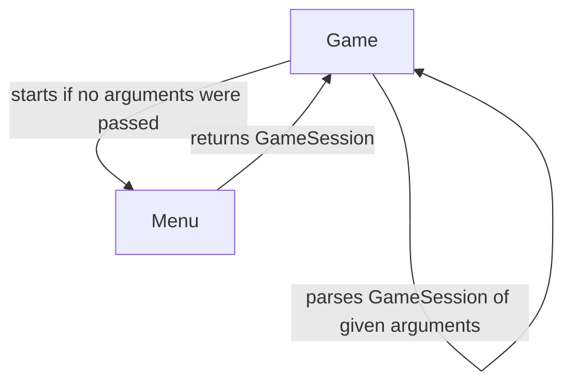
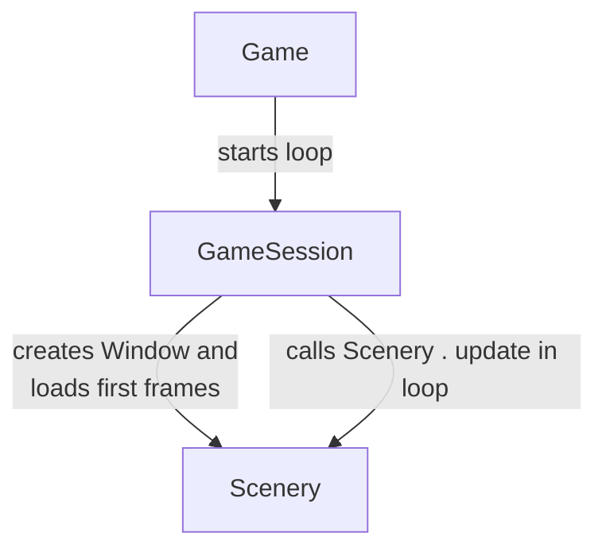
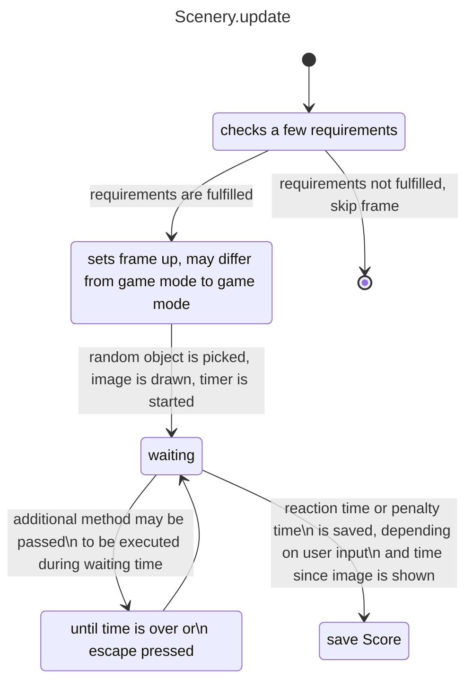

# ReactionGame

## Gamemode

|          Name          |                                                                                Description                                                                                |
|:----------------------:|:-------------------------------------------------------------------------------------------------------------------------------------------------------------------------:|
|  DirectClickReaction   |                                                                          s. project requirements                                                                          |
|  ColorChangeReaction   |                                                                          s. project requirements                                                                          |
|  EveryObjectReaction   |           Inherits form DirectClickReaction and has the exact same game mechanics, except all object may be valid objects to be randomly picked by the program.           |
|   SelectCarsReaction   | All objects are marked in blue and may be clicked. If a car is clicked the time it took to click that car will be saved. If the user misses a penalty time will be saved. |
| ShrinkingBoxesReaction |               Inherits from DirectClickReaction and uses most of its methods except the boxes get smaller and smaller over time increasing the difficulty.                |

<details>
<summary>Program diagram</summary>

#### Phase 1:



#### Phase 2:



#### Phase 3



</details>

## Additions

### Visual feedback

As the development continued it lacked visual feedback. This inconvenience was ruled out by Lines that will be drawn to
the nearest correct box and dots that indicate where the user clicked.

#### Lines

The lines indicate all correct boxes if the user clicked at a wrong spot.
The calculation determines the intersection point of a straight line from the clicked point to the border of each
correct box. When calculated the lines will be drawn from the border of each correct box to the point the user clicked.

#### Dots

To show the user where he clicked, especially when playing ShrinkingBoxReaction, a dot will be drawn at the point of
user input.

## Setup

To run and compile this project you need to have cmake(preferably the gui version) and a working c++ compiler installed.
Any other requirement will be checked by the program during the build and run process.
If a requirement is not fulfilled there will be an error message which explains what to do.
<br><br>Create build folder:

```shell
mkdir build
cd build
```

Build command for application (execute in build folder):

```shell
cmake -G "MinGW Makefiles" -DCMAKE_BUILD_TYPE=Debug ..
cmake --build . --target ReactionGame
cmake --build . --target ReactionGame_app
```

Build command for GoogleTest (execute in build folder):

```shell
cmake -G "MinGW Makefiles" -DCMAKE_BUILD_TYPE=Debug ..
cmake --build . --target ReactionGame
cmake --build . --target ReactionGameTest
```

Run .exe file, located in the build folder, or the build/test folder depending on what you built.
<br><br>
List of requirements, if you don't just try to build it and see what the error messages say:

- Environmental variables:
    - OPEN_CV_PATH : path to opencv (should end on \"...build/install/\")
    - KITTI_PATH : points a folder with the following structure containing the KITTI-images and their corresponding
      labels

```
.
└── [folder to which KITTI_PATH points]
    ├── data_tracking_image_2
    │   ├── testing
    │   └── training
    └── data_tracking_label_2
        ├── testing
        └── training
```

Download [KITTI-images](https://s3.eu-central-1.amazonaws.com/avg-kitti/data_tracking_image_2.zip) (14.7GB)
and [KITTI-labels](https://s3.eu-central-1.amazonaws.com/avg-kitti/data_tracking_label_2.zip) (2.2 MB) 